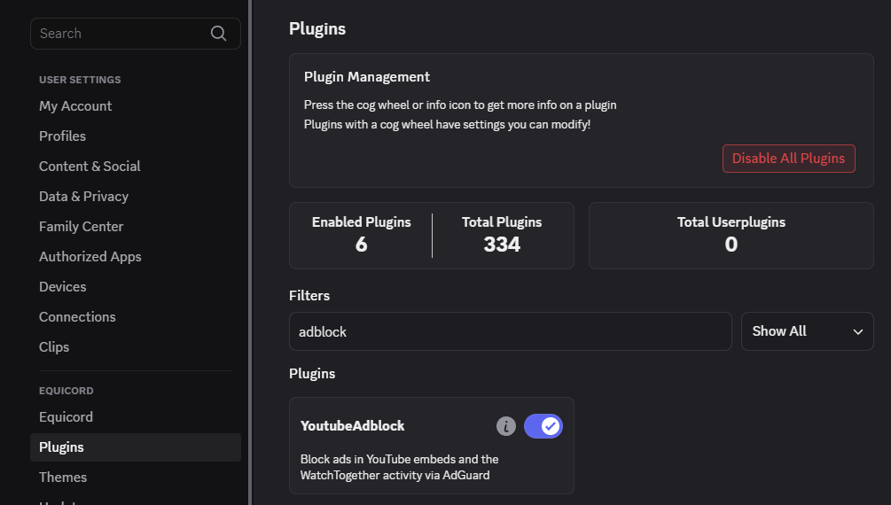

# detachhead's filter lists

note: this project was originally called `ublock-filters` but it's not specific to ublock. https://github.com/DetachHead/ublock-filters/issues/4

## ublock/adguard filters

- [`list.txt`](./list.txt) - ads, malicious sites and right click/devtools blockers
- [`annoyances.txt`](./annoyances.txt) - annoying buttons, buttons in navs that are rarely used

### [subscribe](https://detachhead.github.io/ublock-filters/)

## discord adblocker

[`list.txt`](./list.txt) contains filters for blocking discord ads. however that won't work for you if you are not using the discord web app in your browser, which is why these filters are also available in [`discord.css`](./discord.css) - a theme that can be installed to a discord client mod such as [equicord](https://github.com/Equicord/Equicord).

note that the purpose of this list is strictly to block ads (aka. quests). if you would like to also block other elements such as nitro promotions, i recommend checking out [Disblock Origin](https://codeberg.org/AllPurposeMat/Disblock-Origin).

### installation

add the following URL to your client mod's theme settings:

```
https://raw.githubusercontent.com/DetachHead/ublock-filters/refs/heads/master/discord.css
```

### blocking youtube ads in discord

i recommend also enabling the [YoutubeAdblock](https://github.com/Equicord/Equicord/tree/main/src/plugins/youtubeAdblock.desktop) plugin:


